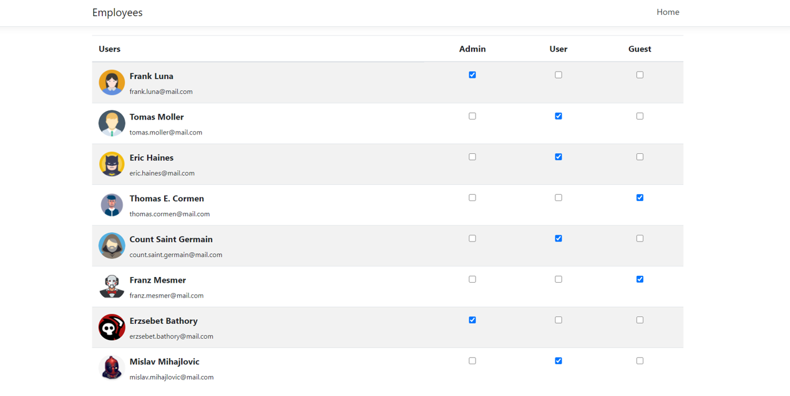

# User-roles application

This repository contains a basic employee-role application created using ASP.NET Core and React.

The application features a table of several users who have pre-assigned roles (Admin, User, Guest). 
The checkboxex  in the table columns enable certain CRUD operations on users such as adding and removing roles.

## Running the app

Clone the repo by copying the link above and in your desired directory run `git clone [link]`.

Open the created folder in [Visual Studio](https://visualstudio.microsoft.com/). 
Click the Run button on top of the window ( by deafult, web application projects in Visual Studio use IIS as the development server).

## Demo

